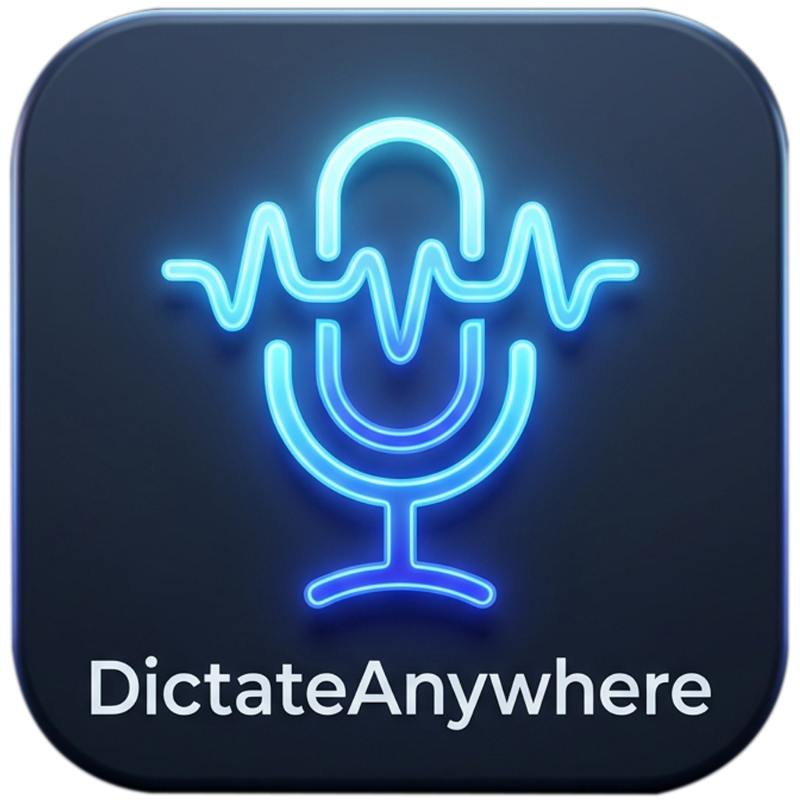

<div align="center">

  

  # DictateAnywhere

  **Cross-platform hybrid voice dictation for Windows and macOS.**  
  Injects transcribed text directly at your cursor in any active application using offline local `faster-whisper` (GPU/CPU) or active Cloud STT engines (Google Gemini, Microsoft Azure, Sarvam AI).

  
  
  
  

  [📥 Download Releases](https://github.com/RhythmicDias/DictateAnywhere/releases) • [📖 Documentation](#features)

</div>

---

## Overview

DictateAnywhere is a privacy-first, lightning-fast dictation application built with **Tauri v2**, **Rust**, **React**, and a **Python Sidecar**. It lives quietly in your system tray or menu bar and types whatever you speak into any input field across your operating system.

---

## Features

| Feature | Details |
|---|---|
| **Cross-Platform** | Native support for **Windows 10/11** and **macOS** (Apple Silicon M-Series & Intel). |
| **Hybrid STT Architecture** | Offline `faster-whisper` (CPU/GPU) with optional automatic Cloud STT fallback. |
| **Active Cloud Provider Selector** | Switch between **Google Gemini**, **Microsoft Azure Speech**, or **Sarvam AI** with one click. |
| **Disfluency & Filler Word Removal** | Automatically filters out hesitation sounds ("um", "uh", "hmm", "hmmm", "ah", "er") across all engines. |
| **GPU Acceleration** | Full CUDA/cuBLAS acceleration for NVIDIA GPUs (RTX 5060/4060/3060+). |
| **AI Text Polishing** | Integrated LLM refinement via local **Ollama** or cloud models (**Google Gemini**, **OpenRouter**, **Groq**). Fix grammar, format, or apply custom prompts in real time. |
| **Live Waveform & Preview** | Floating overlay window displaying real-time microphone RMS audio levels and tentative transcriptions. |
| **Sarvam AI Support** | High-performance specialized STT for Indian languages (Hindi, Tamil, Telugu, Kannada, Malayalam, Marathi, Bengali, Gujarati). |
| **Floating Mic Button** | Draggable, always-on-top toggle widget with countdown sweep ring indicating max recording duration. |
| **Global Hotkeys** | Fully customizable keyboard shortcuts for dictation (default `Ctrl+Alt+D` / `Cmd+Alt+D`) and LLM polishing (`Ctrl+Alt+P`). |
| **Spoken Punctuation** | Natural spoken command conversions ("period" → `.`, "comma" → `,`, "new paragraph" → `↵↵`, etc.). |
| **Word Corrections** | Custom find-and-replace dictionary applied to all transcriptions. |
| **App Launcher** | Voice command triggers to launch local applications, scripts, or files (e.g. "open notepad"). |
| **Secure Credentials** | Cloud API keys stored in OS secure storage (Windows DPAPI / macOS Keychain). |

---

## Quick Start (Pre-built Binaries)

1. Download the latest installer for your operating system from [GitHub Releases](https://github.com/RhythmicDias/DictateAnywhere/releases/latest).
2. Launch **DictateAnywhere**. The app will run silently in your system tray / menu bar.
3. Press `Ctrl+Alt+D` (Windows) or `Cmd+Alt+D` (macOS) to start dictation, speak, and press it again to inject text at your cursor.

---

## Usage & Shortcuts

| Action | Control |
|---|---|
| **Toggle Dictation** | Press `Ctrl+Alt+D` (or click Floating Mic Button) |
| **Toggle Text Polish** | Press `Ctrl+Alt+P` |
| **Open Settings** | Right-click system tray icon → **Settings** |
| **View History** | Right-click system tray icon → **Session History** |
| **Move Floating Widget** | Click and drag the floating mic button anywhere |

### Spoken Punctuation Commands

| Spoken Phrase | Typed Output |
|---|---|
| "period" / "full stop" | `.` |
| "comma" | `,` |
| "question mark" | `?` |
| "exclamation mark" | `!` |
| "new line" / "line break" | `↵` |
| "new paragraph" | `↵↵` |
| "open quote" / "close quote" | `"` |
| "dash" / "hyphen" | `—` / `-` |
| "ellipsis" | `…` |

---

## Cloud STT & API Providers

DictateAnywhere allows seamless selection of your preferred cloud STT provider under **Settings → Cloud STT**:

### 1. Google Gemini (Recommended)
- Highly accurate, fast transcription powered by Gemini 2.0 / 2.5 Flash models.
- Get a free API key from [Google AI Studio](https://aistudio.google.com/).
- Paste your key in the **Cloud STT** tab and toggle **Google Gemini** as the active provider.

### 2. Microsoft Azure Speech
- Enterprise-grade speech recognition via Azure Cognitive Services.
- Create a free resource at [azure.microsoft.com](https://azure.microsoft.com/).
- Enter your API Key and Region (e.g., `eastus`) in the **Cloud STT** tab.

### 3. Sarvam AI (Indian Languages)
- Specialized for Indian languages and accents (Hindi, Tamil, Telugu, etc.).
- Obtain an API key from [Sarvam AI](https://www.sarvam.ai/).
- Supports real-time WebSocket streaming transcription.

---

## Local Development & Building

### Prerequisites

- **Node.js** (v18 or higher) & **npm**
- **Python** (v3.11 or higher)
- **Rust** & **Cargo** — [rustup.rs](https://rustup.rs/)

---

### Setup Instructions

1. **Clone the Repository:**
   ```bash
   git clone https://github.com/RhythmicDias/DictateAnywhere.git
   cd DictateAnywhere
   ```

2. **Create Python Virtual Environment & Install Dependencies:**
   ```bash
   python -m venv .venv
   
   # Windows:
   .\.venv\Scripts\activate
   
   # macOS / Linux:
   source .venv/bin/activate

   pip install -r requirements.txt
   ```

3. **Install Frontend Dependencies:**
   ```bash
   npm install
   ```

4. **Build the Python Sidecar Binary:**
   The desktop app relies on a bundled sidecar binary for audio capture and inference.
   ```bash
   python scripts/build_sidecar.py
   ```
   *Note: This creates the platform-specific executable in `src-tauri/binaries/`.*

5. **Run in Development Mode:**
   ```bash
   npm run tauri dev
   ```

---

### Building Standalone Installers

To package a production release executable/installer for your current OS:

```bash
# 1. Build the updated sidecar executable
python scripts/build_sidecar.py

# 2. Package the native installer (.msi / .exe on Windows, .dmg / .app on macOS)
npm run tauri build
```

The output installers will be generated in `src-tauri/target/release/bundle/`.

---

## Architecture & Project Structure

```
DictateAnywhere/
├── src/                         ← React (TypeScript) Settings & Overlay UI
├── src-tauri/                   ← Rust Core (Tauri v2, OS Windows, Keyring, Hotkeys)
│   ├── binaries/                ← Platform sidecar binaries (whisper_sidecar-*.exe)
│   ├── src/                     ← Rust backend modules
│   └── tauri.conf.json          ← Tauri configuration & permissions
├── sidecar/                     ← Python Sidecar Core
│   ├── whisper_sidecar.py       ← JSON IPC loop & STT orchestrator
│   └── whisper_sidecar.spec     ← PyInstaller spec configuration
├── src/dictateanywhere/         ← Python STT & Core Libraries
│   ├── audio/                   ← Audio capture & WebRTC VAD
│   ├── transcription/           ← local_engine (faster-whisper), gemini, azure, sarvam
│   └── core/                    ← punctuation, corrections, text polish
├── scripts/                     ← build_sidecar.py & utility scripts
├── tests/                       ← Pytest suite
└── README.md
```

---

## License

This project is licensed under the [MIT License](LICENSE).

---

## Acknowledgements

- [Tauri v2](https://v2.tauri.app/) — Next-generation cross-platform desktop framework
- [faster-whisper](https://github.com/SYSTRAN/faster-whisper) — CTranslate2-based Whisper inference
- [Google Gemini API](https://ai.google.dev/) — Multimodal AI models
- [Sarvam AI](https://www.sarvam.ai/) — Speech technology for Indian languages
- [Azure Speech SDK](https://azure.microsoft.com/) — Cloud speech services
